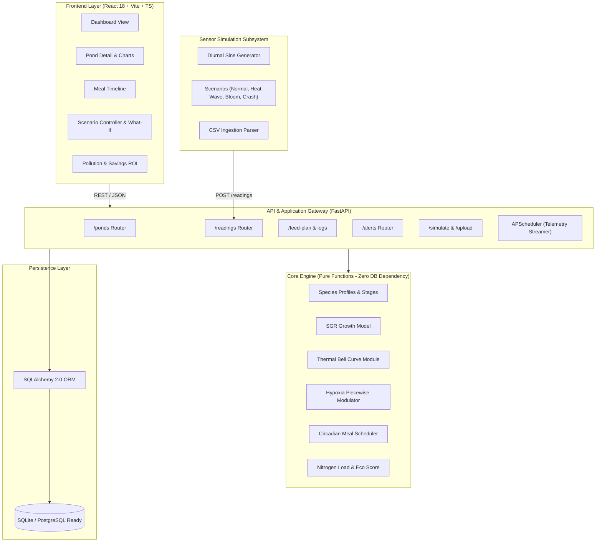
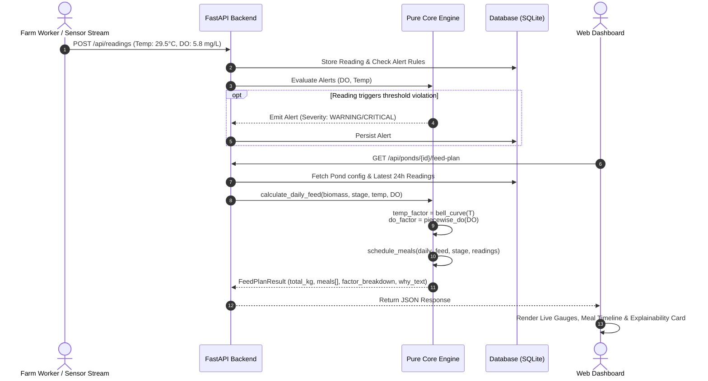

# System Architecture & Technical Design

## 1. Architectural Overview

AquaFeed Optimizer is structured as a decoupled, layered micro-architecture featuring a reactive React TypeScript frontend, a high-throughput Python FastAPI application service, an isolated pure-function computational engine, and an autonomous limnological sensor simulator.

---

## 2. Component Deconstruction

### 2.1 Core Feeding Engine (`backend/app/core/`)
The computational core is strictly decoupled from database and framework concerns. It consists of pure, deterministic functions that take primitive values/dataclasses and return immutable calculation results.
- **`species_profiles.py`**: Configuration dictionary defining thermal limits, DO thresholds, growth stages, feeding rates, and protein fractions for Tilapia, Rohu, and Shrimp.
- **`growth.py`**: Computes weight increment via Daily Specific Growth Rate (SGR), factoring in physiological stress modifiers.
- **`feed_calculator.py`**: Calculates nominal daily feed ration, modulates with temperature and DO factors, caps at maximum biological FCR thresholds, and generates human-readable reasoning strings.
- **`scheduler.py`**: Distributes total daily feed into discrete meals, selects safe temporal daylight windows, and recalculates real-time meal dosages based on immediate water conditions.
- **`pollution.py`**: Determines unassimilated nitrogen/phosphorus loads, calculates the 0–100 Pollution Risk Index, and quantifies feed and monetary savings versus static baselines.
- **`alerts.py`**: Evaluates environmental telemetry against species safety margins and issues typed severity alerts (CRITICAL, WARNING, INFO).

### 2.2 Application & Service Layer (`backend/app/`)
- **FastAPI Framework**: High-performance asynchronous API, auto-generating OpenAPI / Swagger specifications.
- **SQLAlchemy 2.0 ORM**: Data persistence with clean unit-of-work repositories. Configured with SQLite for zero-configuration hackathon runs, with PostgreSQL connection-string readiness for production.
- **APScheduler**: Manages automated background ticks for the sensor simulator without requiring external cron daemons.

### 2.3 Sensor Simulator (`simulator/`)
- Implements a diurnal bio-physical aquatic model:
  $$\text{DO}(t) = \overline{\text{DO}} + A_{\text{DO}} \cdot \sin\left(\frac{2\pi (t - 9)}{24}\right) + \epsilon$$
  $$\text{Temp}(t) = \overline{T} + A_{T} \cdot \sin\left(\frac{2\pi (t - 11)}{24}\right) + \epsilon$$
- Simulates realistic limnological dynamics: nocturnal respiratory oxygen consumption reaching a nadir pre-dawn (05:00–06:00) and afternoon photosynthetic peak (14:00–16:00).
- Ingests preset stress vectors:
  - `Heat Wave`: Sustained temperatures $> 34^\circ\text{C}$ inducing thermal stress.
  - `Algal Bloom`: Extreme supersaturation in daytime followed by acute midnight anoxia.
  - `DO Crash`: Catastrophic collapse below $3.0\text{ mg/L}$, triggering mandatory feed cut-offs.

### 2.4 Presentation Layer (`frontend/`)
- Single Page Application built on React 18, TypeScript, and Vite.
- Tailwind CSS with an aquatic color scheme (teal, ocean blues, emerald, amber alerts, crimson emergency).
- Recharts for multi-axis diurnal water quality trends and growth projection curves.
- TanStack React Query for cached, reactive state synchronization with backend polling.

---

## 3. End-to-End Data Flow

---

## 4. Security & Deployment Architecture

- **Docker Containerization**: Multi-stage build for frontend (distributing static bundle via Nginx) and Python 3.11-slim container for backend.
- **CORS Middleware**: Explicitly whitelist origins for development and production domains.
- **Input Validation**: Strict runtime schema enforcement via Pydantic v2.
