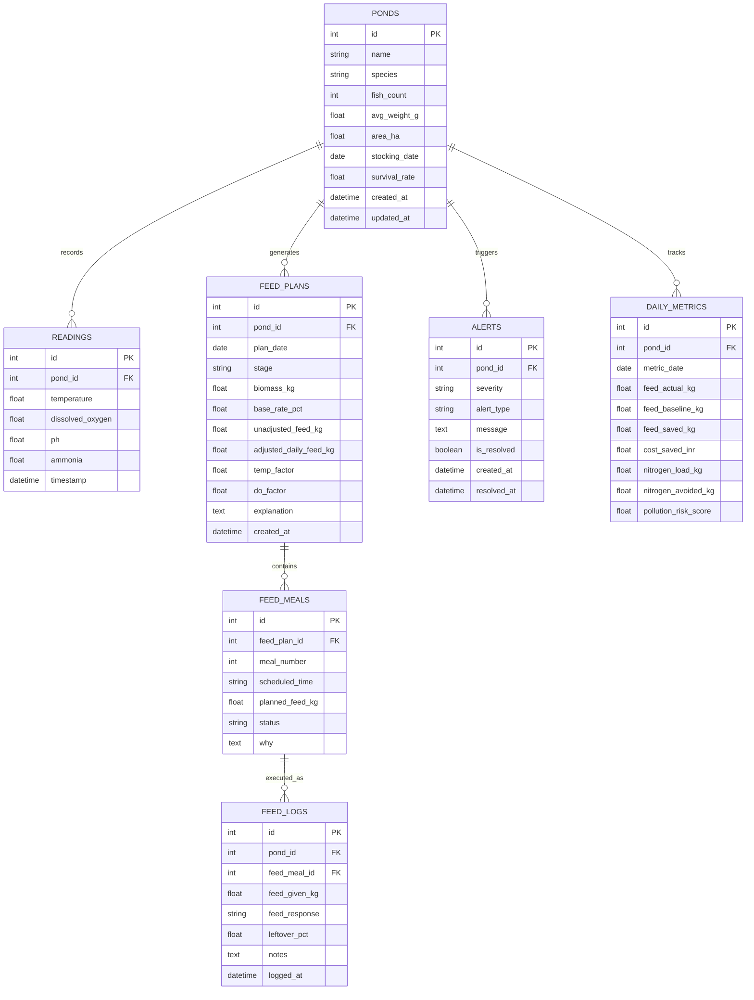

# Database Schema & Entity-Relationship Model

## 1. Entity-Relationship Diagram

---

## 2. Table Schemas & Data Constraints

### 2.1 Table: `ponds`
Stores individual aquaculture enclosure parameters and biological cohort characteristics.
- `id`: `INTEGER PRIMARY KEY AUTOINCREMENT`
- `name`: `VARCHAR(100) NOT NULL` (e.g. "Pond Alpha")
- `species`: `VARCHAR(50) NOT NULL` (`tilapia`, `rohu`, `shrimp`)
- `fish_count`: `INTEGER NOT NULL CHECK(fish_count > 0)`
- `avg_weight_g`: `FLOAT NOT NULL CHECK(avg_weight_g > 0)`
- `area_ha`: `FLOAT NOT NULL CHECK(area_ha > 0)` (Hectares)
- `stocking_date`: `DATE NOT NULL`
- `survival_rate`: `FLOAT NOT NULL DEFAULT 0.90 CHECK(survival_rate BETWEEN 0.0 AND 1.0)`
- `created_at`: `TIMESTAMP DEFAULT CURRENT_TIMESTAMP`
- `updated_at`: `TIMESTAMP DEFAULT CURRENT_TIMESTAMP`

### 2.2 Table: `readings`
Time-series water telemetry from manual probes, automated simulator, or CSV ingestion.
- `id`: `INTEGER PRIMARY KEY AUTOINCREMENT`
- `pond_id`: `INTEGER NOT NULL REFERENCES ponds(id) ON DELETE CASCADE`
- `temperature`: `FLOAT NOT NULL` (Celsius)
- `dissolved_oxygen`: `FLOAT NOT NULL` (mg/L)
- `ph`: `FLOAT NULL` (Standard pH units, typically 6.5–8.5)
- `ammonia`: `FLOAT NULL` (Total Ammonia Nitrogen in mg/L)
- `timestamp`: `TIMESTAMP NOT NULL INDEX`

### 2.3 Table: `feed_plans`
Daily computed feeding allowances produced by the bioenergetics engine.
- `id`: `INTEGER PRIMARY KEY AUTOINCREMENT`
- `pond_id`: `INTEGER NOT NULL REFERENCES ponds(id) ON DELETE CASCADE`
- `plan_date`: `DATE NOT NULL INDEX`
- `stage`: `VARCHAR(30) NOT NULL` (`fry`, `fingerling`, `juvenile`, `grower`, `finisher`)
- `biomass_kg`: `FLOAT NOT NULL`
- `base_rate_pct`: `FLOAT NOT NULL`
- `unadjusted_feed_kg`: `FLOAT NOT NULL`
- `adjusted_daily_feed_kg`: `FLOAT NOT NULL`
- `temp_factor`: `FLOAT NOT NULL`
- `do_factor`: `FLOAT NOT NULL`
- `explanation`: `TEXT NOT NULL`
- `created_at`: `TIMESTAMP DEFAULT CURRENT_TIMESTAMP`

### 2.4 Table: `feed_meals`
Discrete scheduled meal allotments for a given day.
- `id`: `INTEGER PRIMARY KEY AUTOINCREMENT`
- `feed_plan_id`: `INTEGER NOT NULL REFERENCES feed_plans(id) ON DELETE CASCADE`
- `meal_number`: `INTEGER NOT NULL`
- `scheduled_time`: `VARCHAR(10) NOT NULL` (e.g. "08:30")
- `planned_feed_kg`: `FLOAT NOT NULL`
- `status`: `VARCHAR(20) NOT NULL DEFAULT 'pending'` (`pending`, `completed`, `skipped`)
- `why`: `TEXT NOT NULL`

### 2.5 Table: `feed_logs`
Historical audit of feed delivered and appetite observations.
- `id`: `INTEGER PRIMARY KEY AUTOINCREMENT`
- `pond_id`: `INTEGER NOT NULL REFERENCES ponds(id) ON DELETE CASCADE`
- `feed_meal_id`: `INTEGER NULL REFERENCES feed_meals(id) ON DELETE SET NULL`
- `feed_given_kg`: `FLOAT NOT NULL`
- `feed_response`: `VARCHAR(30) NOT NULL` (`eaten_fully`, `normal`, `leftovers`, `refused`)
- `leftover_pct`: `FLOAT NOT NULL DEFAULT 0.0`
- `notes`: `TEXT NULL`
- `logged_at`: `TIMESTAMP DEFAULT CURRENT_TIMESTAMP`

### 2.6 Table: `alerts`
Environmental risk warnings and feed suspensions.
- `id`: `INTEGER PRIMARY KEY AUTOINCREMENT`
- `pond_id`: `INTEGER NOT NULL REFERENCES ponds(id) ON DELETE CASCADE`
- `severity`: `VARCHAR(20) NOT NULL` (`INFO`, `WARNING`, `CRITICAL`)
- `alert_type`: `VARCHAR(50) NOT NULL` (`LOW_DO_HYPOXIA`, `HEAT_STRESS`, `COLD_STRESS`, `HIGH_POLLUTION_RISK`, `FEEDING_SUSPENDED`)
- `message`: `TEXT NOT NULL`
- `is_resolved`: `BOOLEAN NOT NULL DEFAULT 0`
- `created_at`: `TIMESTAMP DEFAULT CURRENT_TIMESTAMP`
- `resolved_at`: `TIMESTAMP NULL`

### 2.7 Table: `daily_metrics`
Aggregated ledger of ecological dividends and savings.
- `id`: `INTEGER PRIMARY KEY AUTOINCREMENT`
- `pond_id`: `INTEGER NOT NULL REFERENCES ponds(id) ON DELETE CASCADE`
- `metric_date`: `DATE NOT NULL INDEX`
- `feed_actual_kg`: `FLOAT NOT NULL`
- `feed_baseline_kg`: `FLOAT NOT NULL`
- `feed_saved_kg`: `FLOAT NOT NULL`
- `cost_saved_inr`: `FLOAT NOT NULL`
- `nitrogen_load_kg`: `FLOAT NOT NULL`
- `nitrogen_avoided_kg`: `FLOAT NOT NULL`
- `pollution_risk_score`: `FLOAT NOT NULL`
